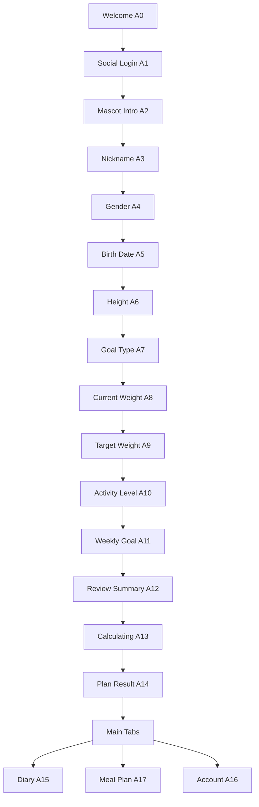

# DNT React Native Technical Specification
**Phiên bản:** v1.0  
**Ngôn ngữ:** Tiếng Việt  
**Nguồn đầu vào:** 18 màn hình A0–A17 từ bộ ảnh người dùng cung cấp  
**Mục tiêu tài liệu:** chuyển bộ UI hiện có thành một spec kỹ thuật đủ chi tiết để team React Native triển khai UI, flow, state, navigation, logic nền tảng và checklist nghiệm thu.

---

## 1. Phạm vi tài liệu

Tài liệu này mô tả:

- Kiến trúc app React Native đề xuất
- Điều hướng và phân lớp navigator
- Design system và nguyên tắc layout
- Danh sách screen có trong bộ ảnh
- Component tái sử dụng
- State model, data model, validation rule
- Logic tính toán dinh dưỡng cơ bản phục vụ onboarding/result
- Analytics, testing, accessibility
- Open questions và risk cần chốt trước khi production

### Ngoài phạm vi
Các hạng mục dưới đây **chưa có đủ dữ liệu trong bộ ảnh**, nên chỉ được đánh dấu là placeholder / TBD:

- Home tab thực tế của app (bottom tab có `Trang chủ` nhưng không có screenshot màn này)
- Luồng Quick Add khi bấm nút `+` ở tab giữa
- Nội dung thật cho tab `Khám phá` / `Đã lưu` ở màn thực đơn
- Backend auth thực tế
- AI meal planning engine
- Health integrations như Apple Health / Google Fit / Health Connect

---

## 2. Tóm tắt sản phẩm từ bộ ảnh

App là một **ứng dụng dinh dưỡng cá nhân hóa** có mascot dẫn chuyện và dark UI premium. Luồng chính:

1. **Marketing / entry**
   - A0 welcome hero
   - A1 social login
   - A2 mascot greeting

2. **Conversational onboarding**
   - A3 nickname
   - A4 gender
   - A5 birth date
   - A6 height
   - A7 goal type
   - A8 current weight
   - A9 target weight
   - A10 activity level
   - A11 weekly goal

3. **Review + calculate**
   - A12 summary
   - A13 calculating
   - A14 plan result

4. **Main product**
   - A15 diary timeline
   - A16 account/profile
   - A17 meal plan empty state

### Product personality
- Cute, friendly, mascot-driven
- Premium dark visual
- Heavy use of rounded cards and purple gradients
- Data-centric but not too clinical
- Strong emphasis on one primary CTA per screen

---

## 3. Giả định sản phẩm để engineering có thể triển khai

### 3.1 Persona
- Người dùng Việt muốn theo dõi cân nặng, calo và macro
- Thiết bị ưu tiên: Android trước, iOS song song
- Hướng dùng: 1 tay, màn dọc

### 3.2 Assumptions bắt buộc
1. V1 dùng **đơn vị metric**: kg, cm, kcal.
2. Onboarding là **linear flow**, không nhảy cóc.
3. Draft onboarding được lưu local để quay lại tiếp tục.
4. Sau khi có kết quả A14, người dùng vào main app.
5. Main app có 5 tab:
   - Trang chủ (placeholder)
   - Nhật ký
   - Nút cộng giữa
   - Thực đơn
   - Tài khoản

### 3.3 Đơn vị và Quy chuẩn
Ứng dụng sử dụng hệ đo lường Metric tiêu chuẩn (kg, cm, kcal) cho mọi lứa tuổi để tính toán các chỉ số BMR và TDEE cơ bản.

---

## 4. Kiến trúc kỹ thuật đề xuất

## 4.1 Recommended baseline
- **React Native + TypeScript**
- **Expo managed workflow** cho giai đoạn build nhanh và đồng bộ asset/theme
- Dùng **custom development build** khi cần native integration nâng cao
- Tổ chức app theo hướng **feature-first**

### Vì sao chọn baseline này
- Bộ UI dùng nhiều gradient, animation nhẹ, asset minh họa, chart và flow onboarding dài.
- Expo giúp xử lý font, asset, haptics, splash, build pipeline gọn hơn.
- React Native + TypeScript phù hợp để scale design system và typed navigation.

## 4.2 Navigation stack
- `@react-navigation/native`
- `@react-navigation/native-stack` cho root stack / onboarding stack
- `@react-navigation/bottom-tabs` cho main tabs

### Lý do
- Native stack phù hợp cho chuyển màn mượt và gesture tự nhiên.
- Bottom tabs tiêu chuẩn dễ custom UI để match bộ ảnh hơn native-bottom-tabs experimental.

## 4.3 State management
Chia thành 3 lớp:

1. **Server state**: TanStack Query  
   Dùng cho dữ liệu có vòng đời fetch/cache/invalidate từ API.

2. **Client app state**: Zustand  
   Dùng cho:
   - onboarding draft
   - session flags
   - selected date trên diary
   - local UI state chia sẻ nhẹ

3. **Persistence**
   - AsyncStorage cho draft onboarding, tùy chọn user, last-used filters
   - secure OS-backed storage cho token session

## 4.4 UI & rendering
- `react-native-safe-area-context`
- `expo-linear-gradient`
- `react-native-svg` cho donut chart, BMI marker, mini chart
- `react-native-reanimated` cho animation mượt nếu cần
- `StyleSheet` + theme tokens, tránh phụ thuộc vào CSS-in-JS nặng

## 4.5 Data validation
- Validate tại 2 tầng:
  - UI layer: enable/disable CTA, input sanitation
  - Domain layer: guard business rules trước khi submit/generate plan

---

## 5. Package boundaries

```text
Presentation layer
  screens/
  components/
  navigation/
  theme/

Domain layer
  models/
  calculators/
  validators/
  mappers/

Data layer
  api/
  repositories/
  storage/
  services/

App layer
  providers/
  bootstrap/
  config/
```

### Nguyên tắc
- Screen không tự giữ business formula phức tạp.
- Formula BMI/TDEE/macro nằm trong `domain/calculators`.
- Storage access qua repository/service, không gọi AsyncStorage trực tiếp trong screen.
- Component reusable không import store cụ thể.

---

## 6. Thư mục code đề xuất

```text
src/
  app/
    App.tsx
    bootstrap/
      initApp.ts
    providers/
      AppProviders.tsx
      NavigationProvider.tsx
      QueryProvider.tsx
      ThemeProvider.tsx
  navigation/
    RootNavigator.tsx
    PublicNavigator.tsx
    OnboardingNavigator.tsx
    MainTabNavigator.tsx
    types.ts
  theme/
    colors.ts
    spacing.ts
    radius.ts
    typography.ts
    shadows.ts
    index.ts
  assets/
    mascot/
    illustrations/
    icons/
    fonts/
  components/
    layout/
      SafeScreen.tsx
      ScreenBackground.tsx
      BottomCtaBar.tsx
      Section.tsx
    buttons/
      GradientButton.tsx
      SecondaryButton.tsx
      SocialAuthButton.tsx
      IconCircleButton.tsx
    onboarding/
      OnboardingHeader.tsx
      MascotQuestionBubble.tsx
      LargeTextInput.tsx
      GenderOptionCard.tsx
      GoalOptionCard.tsx
      ActivityOptionCard.tsx
      HorizontalRulerPicker.tsx
      WheelDatePicker.tsx
      WeeklyGoalSlider.tsx
      BMIInfoCard.tsx
      BMIScaleBar.tsx
      SummaryInfoCard.tsx
      LoadingStepRow.tsx
    dashboard/
      MacroDonutChart.tsx
      MacroLegendItem.tsx
      StatCard.tsx
      InfoBanner.tsx
      JourneyProgressCard.tsx
      SummaryMetricStrip.tsx
    diary/
      DiaryHeader.tsx
      MacroSummaryStrip.tsx
      TimelineHourRow.tsx
    meal/
      SegmentedPillTabs.tsx
      EmptyMealPlanState.tsx
    account/
      AvatarEditor.tsx
      TrialBanner.tsx
      QuickInfoPillRow.tsx
      SocialLinkCard.tsx
  features/
    auth/
      screens/
        WelcomeScreen.tsx
        SocialLoginScreen.tsx
      services/
        authService.ts
      store/
        authStore.ts
    onboarding/
      screens/
        MascotIntroScreen.tsx
        NicknameScreen.tsx
        GenderScreen.tsx
        BirthDateScreen.tsx
        HeightScreen.tsx
        GoalTypeScreen.tsx
        CurrentWeightScreen.tsx
        TargetWeightScreen.tsx
        ActivityLevelScreen.tsx
        WeeklyGoalScreen.tsx
        ReviewSummaryScreen.tsx
        CalculatingPlanScreen.tsx
        PlanResultScreen.tsx
      store/
        onboardingStore.ts
      domain/
        calculators/
          bmi.ts
          calories.ts
          macro.ts
          targetDate.ts
        validators/
          onboardingValidators.ts
      repositories/
        onboardingRepository.ts
    diary/
      screens/
        DiaryTimelineScreen.tsx
      store/
        diaryStore.ts
      repositories/
        diaryRepository.ts
    mealPlan/
      screens/
        MealPlanScreen.tsx
      repositories/
        mealPlanRepository.ts
    account/
      screens/
        AccountScreen.tsx
      repositories/
        accountRepository.ts
    home/
      screens/
        HomePlaceholderScreen.tsx
  domain/
    models/
      user.ts
      nutrition.ts
      diary.ts
      mealPlan.ts
    types/
      common.ts
  data/
    api/
      client.ts
      endpoints.ts
    storage/
      keys.ts
      asyncStorage.ts
      secureStorage.ts
    mocks/
      testimonials.ts
      diary.ts
      mealPlan.ts
  hooks/
    useTheme.ts
    useSafeBottomInset.ts
    useDebouncedValue.ts
    useHaptics.ts
  utils/
    date.ts
    number.ts
    string.ts
    accessibility.ts
  analytics/
    events.ts
    tracker.ts
  test/
    fixtures/
    mocks/
```

---

## 7. Navigation specification

## 7.1 Route map tổng



## 7.2 Root navigator
`RootStackNavigator`

Routes:
- `Welcome`
- `SocialLogin`
- `MascotIntro`
- `OnboardingStack`
- `PlanResult` (nếu tách khỏi onboarding stack)
- `MainTabs`
- `QuickAddModal` (placeholder)
- `GlobalWebView` (legal/support, optional)

## 7.3 Onboarding stack
`OnboardingStackNavigator`

Order cố định:
1. Nickname
2. Gender
3. BirthDate
4. Height
5. GoalType
6. CurrentWeight
7. TargetWeight
8. ActivityLevel
9. WeeklyGoal
10. ReviewSummary
11. Calculating
12. PlanResult

### Chuyển màn
- `animation: slide_from_right`
- Back giữ state local/store
- Progress bar dựa trên `currentStep / totalSteps`

## 7.4 Main tabs
`MainTabNavigator`

Tabs:
- `Home` → placeholder cho đến khi có design
- `Diary`
- `QuickAddAction` → intercept press, mở modal/action sheet
- `MealPlan`
- `Account`

### Rule
- Tab giữa không phải screen thật; nó là action button.
- `Diary`, `MealPlan`, `Account` là màn đã có design.
- `Home` bắt buộc tạo placeholder để nav không gãy.

---

## 8. Route params đề xuất

```ts
type RootStackParamList = {
  Welcome: undefined;
  SocialLogin: undefined;
  MascotIntro: undefined;
  OnboardingStack: undefined;
  MainTabs: undefined;
  QuickAddModal: { selectedDate?: string; hour?: number } | undefined;
  GlobalWebView: { title: string; url: string };
};

type OnboardingStackParamList = {
  Nickname: undefined;
  Gender: undefined;
  BirthDate: undefined;
  Height: undefined;
  GoalType: undefined;
  CurrentWeight: undefined;
  TargetWeight: undefined;
  ActivityLevel: undefined;
  WeeklyGoal: undefined;
  ReviewSummary: undefined;
  Calculating: undefined;
  PlanResult: undefined;
};

type MainTabParamList = {
  Home: undefined;
  Diary: undefined;
  QuickAddAction: undefined;
  MealPlan: undefined;
  Account: undefined;
};
```

---

## 9. Screen inventory matrix

| ID | Route | Navigator | Mục tiêu | Input chính | Output / next |
|---|---|---|---|---|---|
| A0 | Welcome | Root | Hero intro app | none | A1 |
| A1 | SocialLogin | Root | vào auth | Google/Facebook | A2 hoặc MainTabs |
| A2 | MascotIntro | Root | warm onboarding | CTA | A3 |
| A3 | Nickname | Onboarding | lấy nickname | text | A4 |
| A4 | Gender | Onboarding | chọn giới tính | 2 cards | A5 |
| A5 | BirthDate | Onboarding | chọn ngày sinh | wheel | A6 |
| A6 | Height | Onboarding | lấy chiều cao | ruler | A7 |
| A7 | GoalType | Onboarding | chọn mục tiêu | cards | A8 |
| A8 | CurrentWeight | Onboarding | cân nặng hiện tại | ruler | A9 |
| A9 | TargetWeight | Onboarding | cân nặng mục tiêu | ruler | A10 |
| A10 | ActivityLevel | Onboarding | cường độ tập luyện | list cards | A11 |
| A11 | WeeklyGoal | Onboarding | tốc độ hàng tuần | slider | A12 |
| A12 | ReviewSummary | Onboarding | review input | none | A13 |
| A13 | Calculating | Onboarding | loading + trust | none | A14 |
| A14 | PlanResult | Onboarding | show plan | none | MainTabs |
| A15 | DiaryTimeline | MainTab | nhật ký theo giờ | plus per slot | QuickAdd modal |
| A16 | Account | MainTab | hồ sơ + dashboard | buttons | deep links/settings |
| A17 | MealPlan | MainTab | empty state meal plan | CTA | AI flow / saved plans |

---

## 10. Design system and layout rules

## 10.1 Base design tokens
Nên dùng file token đã tạo trước đó:
- `dnt_design_tokens.json`
- `dnt_theme.ts`

### Token gốc
- `bg.base = #111020`
- `bg.elevated = #1C1A2C`
- `surface.1 = #252238`
- `surface.2 = #302C44`
- `primary.500 = #A56CFF`
- `primary.600 = #8E57F5`
- `primary.700 = #6D3DE6`
- `text.primary = #FFFFFF`
- `text.secondary = #C7C3D8`
- `text.muted = #9B97AE`
- `warning = #F2B437`
- `macro.protein = #FF5A5F`
- `macro.carbs = #3D8BFF`
- `macro.fat = #F5B323`

## 10.2 Layout baseline
Thiết kế nên map từ screenshot sang hệ dp như sau:
- Base width: **360dp**
- Horizontal padding: **20–24dp**
- Header top inset: safe area + 8
- CTA bottom inset: max(safeBottom, 16) + 8
- Card radius: **20 / 24 / 28**
- Pill/button radius: **999**
- Section gap: **24**
- Screen background: gradient trên -> tối dưới

## 10.3 Typography
Suggested scale:
- Display: 36–40
- H1: 32–34
- H2: 26–28
- H3: 20–22
- Body: 16–17
- Caption: 12–13

### Font strategy
- 1 font family cho toàn app
- 2–3 weights là đủ: Regular / Medium / Bold
- Không trộn nhiều font để tránh sai visual của source

---

## 11. Reusable components specification

## 11.1 `SafeScreen`
Wrapper chuẩn cho mọi screen.

**Props**
- `children`
- `withBackgroundGlow?: boolean`
- `scrollable?: boolean`
- `contentContainerStyle?`
- `edges?: Edge[]`

**Rule**
- Phải xử lý safe area top/bottom.
- Không screen nào tự hardcode padding top theo status bar.

## 11.2 `OnboardingHeader`
Hiển thị back + progress bar.

**Props**
- `step: number`
- `totalSteps: number`
- `onBack?: () => void`
- `showDivider?: boolean`

**Visual**
- Back icon trái
- Thanh progress mảnh ngang
- Tỷ lệ fill = `step / totalSteps`

## 11.3 `MascotQuestionBubble`
Bubble trắng với avatar mascot trái.

**Props**
- `text: string`
- `size?: 'sm' | 'md' | 'lg'`
- `avatarUri?: string`

**Rule**
- Chiều cao bubble tự giãn theo text
- Bubble không vượt 4 dòng trên mobile nhỏ

## 11.4 `GradientButton`
CTA chính full-width.

**Props**
- `label`
- `onPress`
- `disabled?`
- `loading?`
- `iconLeft?`
- `testID?`

**States**
- Default: gradient tím
- Disabled: surface tối, text giảm contrast
- Loading: spinner + disabled press

## 11.5 `OptionCard`
Card chọn 1 trong nhiều lựa chọn.

**Props**
- `title`
- `subtitle?`
- `icon?`
- `selected?`
- `onPress`

**Used in**
- GoalType
- ActivityLevel
- Gender

## 11.6 `HorizontalRulerPicker`
Picker cho height/weight.

**Props**
- `min`
- `max`
- `step`
- `value`
- `unit`
- `onChange`
- `majorTickEvery`
- `decimalPlaces`

**Behavior**
- Kéo ngang để thay đổi giá trị
- Tick giữa màn là marker active
- `onMomentumScrollEnd` snap theo `step`

## 11.7 `WheelDatePicker`
Picker 3 cột cho ngày sinh.

**Columns**
- `day`
- `month`
- `year`

**Rule**
- Cho phép lựa chọn năm sinh từ 1930 đến nay.
- Hỗ trợ tính toán tuổi thực tế cho mọi nhóm người dùng.

## 11.8 `BMIScaleBar`
Thanh phân vùng BMI nhiều màu.

**Props**
- `value`
- `segments`
- `markerVisible?`
- `showLabels?`

## 11.9 `BMIInfoCard`
Card hiển thị BMI, trạng thái, mô tả.

**Props**
- `bmi`
- `statusLabel`
- `description`
- `sourceLabel?`

## 11.10 `LoadingStepRow`
Dòng step trong màn calculating.

**Props**
- `label`
- `progress`
- `status: 'idle' | 'loading' | 'done'`

## 11.11 `MacroDonutChart`
Chart donut hiển thị calories và macro split.

**Props**
- `calories`
- `proteinPct`
- `carbPct`
- `fatPct`
- `proteinGram`
- `carbGram`
- `fatGram`

## 11.12 `TimelineHourRow`
Row cho màn diary.

**Props**
- `hourLabel`
- `entriesCount`
- `onAdd`
- `onPress?`
- `isCurrentHour?`

## 11.13 `SegmentedPillTabs`
Tab chip ngang ở meal plan.

**Props**
- `items`
- `activeKey`
- `onChange`

---

## 12. Domain model

## 12.1 Enums

```ts
type Gender = 'female' | 'male';
type GoalType = 'lose_weight' | 'gain_weight' | 'maintain_weight';
type ActivityLevel =
  | 'sedentary'
  | 'light'
  | 'moderate'
  | 'active'
  | 'very_active';

type BMIStatus =
  | 'underweight'
  | 'normal'
  | 'overweight'
  | 'obese';

type AuthProvider = 'google' | 'facebook';
```

## 12.2 User profile draft

```ts
interface OnboardingDraft {
  nickname: string | null;
  gender: Gender | null;
  birthDateISO: string | null;
  heightCm: number | null;
  goalType: GoalType | null;
  currentWeightKg: number | null;
  targetWeightKg: number | null;
  activityLevel: ActivityLevel | null;
  weeklyGoalKg: number | null;
  completedSteps: string[];
  updatedAt: string;
}
```

## 12.3 Final profile

```ts
interface UserProfile {
  id: string;
  nickname: string;
  gender: Gender;
  birthDateISO: string;
  age: number;
  heightCm: number;
  currentWeightKg: number;
  targetWeightKg: number;
  activityLevel: ActivityLevel;
  goalType: GoalType;
}
```

## 12.4 Nutrition plan

```ts
interface MacroSplit {
  proteinPct: number;
  carbPct: number;
  fatPct: number;
  proteinGram: number;
  carbGram: number;
  fatGram: number;
}

interface NutritionPlan {
  bmi: number;
  bmiStatus: BMIStatus;
  bmrKcal: number;
  tdeeKcal: number;
  dailyTargetKcal: number;
  weeklyTargetKcal: number;
  dailyDeficitOrSurplusKcal: number;
  targetDateISO: string;
  macroSplit: MacroSplit;
}
```

## 12.5 Diary model

```ts
interface DiaryEntry {
  id: string;
  dateISO: string;
  hour: number;
  title: string;
  calories: number;
  proteinGram: number;
  carbGram: number;
  fatGram: number;
  type: 'meal' | 'snack' | 'drink';
}

interface DiaryHourSlot {
  hour: number;
  entries: DiaryEntry[];
}
```

## 12.6 Meal plan model

```ts
interface MealPlan {
  id: string;
  title: string;
  dateISO?: string;
  meals: MealPlanMeal[];
  totalCalories: number;
  source: 'ai' | 'saved' | 'template';
}

interface MealPlanMeal {
  id: string;
  name: string;
  timeLabel: string;
  calories: number;
}
```

---

## 13. Business rules & calculations

## 13.1 Validation rules
- Nickname: trim, 2–24 ký tự, cho phép ký tự tiếng Việt, số, khoảng trắng đơn
- Height: 120–220 cm
- Current weight: 30–250 kg
- Target weight:
  - lose weight → `< currentWeight`
  - gain weight → `> currentWeight`
  - maintain → có thể = currentWeight
- Weekly goal: 0.1–1.0 kg/tuần, step 0.1
- Birth date:
  - Không giới hạn độ tuổi, cho phép cả nhóm tuổi dưới 18.

## 13.2 BMI formula
```ts
BMI = weightKg / (heightM * heightM)
```

### BMI band dùng cho UI
Bộ ảnh phù hợp hơn với ngưỡng BMI kiểu châu Á:
- `< 18.5`: thiếu cân
- `18.5 – 22.9`: bình thường
- `23.0 – 24.9`: thừa cân mức đầu
- `25.0 – 27.4`: nguy cơ cao
- `>= 27.5`: béo phì / high risk

### Rule implementation
Để khớp source UI:
- BMIScaleBar hiển thị segment label: `<15`, `18.5`, `22.9`, `24.9`, `29.9`, `>=35`
- Logic badge nên cấu hình bằng config object, không hardcode vào component

## 13.3 Age calculation
```ts
age = differenceInYears(today, birthDate)
```

## 13.4 BMR (baseline recommendation)
Đề xuất Mifflin-St Jeor cho người lớn:

```ts
maleBmr = 10 * weightKg + 6.25 * heightCm - 5 * age + 5
femaleBmr = 10 * weightKg + 6.25 * heightCm - 5 * age - 161
```

> Nếu product cần hỗ trợ giới tính khác hoặc minors, phải chốt công thức riêng với team chuyên môn.

## 13.5 Activity multipliers
Map từ A10:
- `sedentary` → 1.20
- `light` → 1.375
- `moderate` → 1.55
- `active` → 1.725
- `very_active` → 1.90

## 13.6 TDEE
```ts
tdee = bmr * activityMultiplier
```

## 13.7 Weekly goal -> daily calorie delta
Giả định product:
```ts
dailyDelta = (weeklyGoalKg * 7700) / 7
```

### Theo goal type
- Lose weight → `dailyTarget = tdee - dailyDelta`
- Gain weight → `dailyTarget = tdee + dailyDelta`
- Maintain → `dailyTarget = tdee`

### Guardrails khuyến nghị
- Min daily target female adult: 1200 kcal
- Min daily target male adult: 1500 kcal
- Không tạo deficit > 1000 kcal/ngày
- Nếu vi phạm, show recommendation state và kéo weeklyGoal về mức an toàn

## 13.8 Weekly target calories
```ts
weeklyTarget = dailyTarget * 7
```

## 13.9 Macro split
Theo A14/A16:
- Protein 20%
- Carb 50%
- Fat 30%

### Gram conversion
```ts
proteinGram = round((dailyTarget * 0.20) / 4)
carbGram = round((dailyTarget * 0.50) / 4)
fatGram = round((dailyTarget * 0.30) / 9)
```

## 13.10 Target date estimate
```ts
weightDiffKg = abs(currentWeightKg - targetWeightKg)
weeksNeeded = ceil(weightDiffKg / weeklyGoalKg)
targetDate = addWeeks(today, weeksNeeded)
```

---

## 14. Screen-by-screen technical specification

## 14.1 A0 — `WelcomeScreen`
**Mục tiêu:** màn hero giới thiệu app.

**Layout anatomy**
- Logo trên cùng
- Mascot hero ở trung tâm
- Headline 2 dòng
- Description 2 dòng
- Pagination dots
- CTA full-width đáy

**Components**
- `SafeScreen`
- `ScreenBackground`
- `GradientButton`

**Actions**
- CTA → `navigate('SocialLogin')`

**Notes**
- Asset mascot phải có glow nhẹ
- Màn này nên preload font và 1 phần asset onboarding

---

## 14.2 A1 — `SocialLoginScreen`
**Mục tiêu:** entry point cho auth.

**Layout**
- Close icon góc trên phải
- Headline căn giữa
- Subtext
- 2 social button
- Legal text
- Decorative wave/glow đáy

**Components**
- `SocialAuthButton`
- `SecondaryButton` cho close icon
- `SafeScreen`

**Actions**
- Google press → `authService.signIn('google')`
- Facebook press → `authService.signIn('facebook')`
- Close → quay về Welcome hoặc dismiss

**Errors**
- Auth fail → toast/snackbar
- Network fail → retry action

---

## 14.3 A2 — `MascotIntroScreen`
**Mục tiêu:** chuyển cảm xúc từ auth sang onboarding.

**Layout**
- Back
- Divider line ngang
- Bubble trắng to
- Mascot full-body + floating icons
- CTA đáy

**Action**
- CTA → `NicknameScreen`

**Animation**
- Mascot entrance: fade + translateY
- Floating icons: subtle loop, không quá 8px

---

## 14.4 A3 — `NicknameScreen`
**Mục tiêu:** lấy nickname.

**Layout**
- `OnboardingHeader`
- `MascotQuestionBubble`
- Label nhỏ
- Input text lớn
- CTA đáy

**State**
- `nickname: string`

**Validation**
- disable CTA nếu empty
- trim trước khi save

**Action**
- Continue → lưu draft → `GenderScreen`

---

## 14.5 A4 — `GenderScreen`
**Mục tiêu:** chọn giới tính.

**Layout**
- 2 card lớn ngang nhau
- Icon + label

**State**
- `selectedGender`

**Validation**
- CTA disabled nếu chưa chọn

**Action**
- Continue → save → `BirthDateScreen`

---

## 14.6 A5 — `BirthDateScreen`
**Mục tiêu:** chọn ngày sinh bằng wheel picker.

**Layout**
- Bubble
- 3 wheel columns: day, month, year
- CTA

**State**
- `day, month, year`

**Validation**
- date hợp lệ

**Action**
- valid → `HeightScreen`

---

## 14.7 A6 — `HeightScreen`
**Mục tiêu:** lấy chiều cao.

**Layout**
- Bubble
- Giá trị lớn giữa màn
- Ruler ngang phía dưới
- CTA

**Behavior**
- Scroll ruler -> number update realtime
- Snap khi dừng

**Default**
- 160 cm nếu chưa có dữ liệu

---

## 14.8 A7 — `GoalTypeScreen`
**Mục tiêu:** chọn mục tiêu cân nặng.

**Options**
- Giảm cân
- Tăng cân
- Duy trì cân nặng

**Component**
- `GoalOptionCard`

**Behavior**
- Chọn 1
- Card selected có border/overlay tím

---

## 14.9 A8 — `CurrentWeightScreen`
**Mục tiêu:** lấy cân nặng hiện tại và preview BMI.

**Layout**
- Bubble
- Weight number lớn
- Ruler ngang
- `BMIInfoCard`
- Source label
- CTA

**Behavior**
- BMI update realtime theo height + currentWeight
- Status label đổi màu theo zone

## 14.10 A9 — `TargetWeightScreen`
**Mục tiêu:** lấy cân nặng mong muốn.

**Layout**
- giống A8

**Validation**
- Lose weight -> target < current
- Gain weight -> target > current
- Maintain -> target có thể bằng current

**UX**
- Nếu input trái goalType, hiện inline helper thay vì alert

---

## 14.11 A10 — `ActivityLevelScreen`
**Mục tiêu:** lấy mức vận động.

**Options visible**
- Không tập luyện, ít vận động
- Vận động nhẹ nhàng
- Chăm chỉ luyện tập
- Rất năng động
- Cực kỳ năng động

**Interaction**
- List scrollable nếu màn nhỏ
- Chọn 1 card
- CTA enable khi selected

---

## 14.12 A11 — `WeeklyGoalScreen`
**Mục tiêu:** chọn tốc độ giảm/tăng cân.

**Layout**
- Bubble
- Current weekly goal number lớn
- recommendation text
- estimated daily calories text
- slider chậm ↔ rất nhanh
- source label
- CTA

**Business**
- Giá trị slider cập nhật `dailyTarget` preview realtime
- Nếu vượt guardrail, snap về mức max an toàn

---

## 14.13 A12 — `ReviewSummaryScreen`
**Mục tiêu:** review toàn bộ thông tin đầu vào.

**Layout**
- Bubble
- Summary card lớn có illustration
- BMI multi-color scale
- BMI info card
- CTA

**Data shown**
- Goal type
- Target weight
- Activity level
- BMI

**Action**
- Continue → `CalculatingScreen`

---

## 14.14 A13 — `CalculatingPlanScreen`
**Mục tiêu:** tạo cảm giác app đang tính toán và xây trust.

**Layout**
- Headline
- 3 progress rows
- testimonial card
- carousel dots

**Progress steps**
1. Phân tích hồ sơ thể chất
2. Tính toán quá trình trao đổi chất
3. Tính toán calo mục tiêu

**Behavior**
- Animate tuần tự
- Sau khi hoàn tất 100% → auto navigate `PlanResult`
- Nếu API real calculation fail → show retry state

**Timing suggestion**
- Mock UI: 2.2–3.5 giây
- Real API: progress gắn với actual state machine

---

## 14.15 A14 — `PlanResultScreen`
**Mục tiêu:** hiển thị kế hoạch cá nhân hóa.

**Layout**
- Hero line/curve chart trên cùng
- Headline lớn
- Info row với icon info
- Dual stat card: kcal/day, kcal/week
- Breakdown cards: TDEE, deficit/surplus
- Target date card
- Macro donut card
- Yellow info banner
- CTA `Bắt đầu hành trình`

**Data contract**
- `dailyTargetKcal`
- `weeklyTargetKcal`
- `tdeeKcal`
- `dailyDeficitOrSurplusKcal`
- `targetDateISO`
- `macroSplit`

**Action**
- CTA -> mark onboarding complete -> `MainTabs`

---

## 14.16 A15 — `DiaryTimelineScreen`
**Mục tiêu:** nhập nhật ký ăn uống theo timeline giờ.

**Layout**
- Header: menu, previous/next day, title
- Macro summary strip ngang trên
- Scroll list các slot giờ 07:00–23:00
- Mỗi row: hour pill bên trái, line, plus button bên phải
- Bottom tab bar

**Data**
- `selectedDate`
- `daySummary`
- `hourSlots[]`

**Behavior**
- Plus on row → open `QuickAddModal` với hour prefilled
- Swipe/pager date trái phải
- Current hour highlight
- Nếu slot có entry, row đổi thành summary chip/list (TBD, chưa có trong ảnh)

---

## 14.17 A16 — `AccountScreen`
**Mục tiêu:** hồ sơ người dùng + dashboard account.

**Layout**
- Title lớn
- Avatar + mini edit button
- Join date
- Trial banner
- Quick stats row
- CTA `Hồ sơ thể chất`
- Journey card
- Macro goal card + button `Tùy chỉnh mục tiêu`
- Statistics shortcut icons
- Community banner
- Social links cards
- Support row
- Footer logo/version
- Bottom tab bar

**Data**
- profile basic
- membership/trial state
- currentWeight + targetWeight
- daily macro targets
- app version string

**Interactions**
- edit avatar
- open physical profile
- open macro settings
- open statistics reports
- open community CTA
- external social links
- support center
- settings icon

---

## 14.18 A17 — `MealPlanScreen`
**Mục tiêu:** empty state cho thực đơn.

**Layout**
- Title + subtitle
- Segmented tabs
- Empty illustration
- Headline empty state
- Supporting text
- CTA primary: `Tạo thực đơn bằng AI`
- CTA secondary: `Chọn từ kế hoạch đã lưu`
- Bottom tab bar

**Tabs visible from image**
- Kế hoạch của tôi
- Khám phá
- tab thứ 3 bị cắt, giả định `Đã lưu` hoặc tương đương

**Rule**
- Chỉ screen state `empty` được spec chắc chắn
- Nội dung cho tab inactive chưa đủ dữ liệu

**Actions**
- AI CTA → placeholder flow `MealPlanGenerator`
- Saved CTA → `SavedPlansScreen` placeholder

---

## 15. State machines

## 15.1 Onboarding state machine

```text
idle
  -> editing
  -> validating
    -> error
    -> saved
      -> next_step
        -> completed
```

## 15.2 Plan generation state machine

```text
draft_ready
  -> calculate_requested
  -> calculating_profile
  -> calculating_metabolism
  -> calculating_target
  -> success
  -> fail
```

## 15.3 Auth state machine

```text
unauthenticated
  -> social_sign_in_pending
  -> authenticated
  -> profile_incomplete
  -> onboarding
  -> active
```

---

## 16. Data persistence

## 16.1 AsyncStorage keys
```ts
@dnt/onboarding-draft
@dnt/session-flags
@dnt/selected-date
@dnt/meal-plan-filters
@dnt/tutorial-state
```

## 16.2 Persist what
Persist:
- onboarding draft
- selected date on diary
- active meal plan tab
- dismissed banners
- onboarding completed flag

Do not persist:
- loading states
- ephemeral animation progress
- modal open/close
- auth token trong AsyncStorage

---

## 17. API integration contract (provisional)

## 17.1 Auth
```ts
POST /auth/google
POST /auth/facebook
POST /auth/logout
GET  /me
```

## 17.2 Onboarding / profile
```ts
POST /profiles/onboarding
PUT  /profiles/me
GET  /profiles/me
```

## 17.3 Plan generation
```ts
POST /nutrition-plans/generate
GET  /nutrition-plans/current
PUT  /nutrition-plans/current
```

## 17.4 Diary
```ts
GET    /diary?date=YYYY-MM-DD
POST   /diary/entries
PUT    /diary/entries/:id
DELETE /diary/entries/:id
```

## 17.5 Meal plan
```ts
GET  /meal-plans
POST /meal-plans/generate
GET  /meal-plans/:id
POST /meal-plans/:id/apply
```

### Ghi chú
Đây là API shape gợi ý để team mobile tách layer sạch. Vì bộ ảnh không cung cấp backend contract thật, endpoint name có thể đổi.

---

## 18. Animation specification

## 18.1 Global motion principle
- Nhanh, mềm, không phô diễn quá mức
- Duration chính: 180–280ms
- Easing: ease-out cho enter, ease-in-out cho state change

## 18.2 Per pattern
- Screen push: slide + fade nhẹ
- CTA press: scale 0.98 rồi về 1
- Option card selected: border glow + fill change
- Ruler picker: number cập nhật theo scroll
- Loading screen: progress fill tuần tự
- Donut chart: animate stroke on mount
- Floating mascot icons: loop chậm 2.5–4s

---

## 19. Accessibility specification

- Touch target tối thiểu 44x44dp
- Tất cả CTA có `accessibilityRole="button"`
- Bubble question nên map thành heading cho screen reader
- Các thẻ selected có `accessibilityState={{ selected: true }}`
- Donut chart phải có text summary thay thế, không chỉ màu
- Social auth buttons phải có label đầy đủ
- Cho phép Dynamic Type ở text body; headline có thể clamp
- Contrast text/body trên dark background đạt mức dễ đọc
- Với diary timeline, plus button phải announce kèm giờ: `Thêm món ăn lúc 07 giờ`

---

## 20. Internationalization & formatting

- Locale mặc định `vi-VN`
- Định dạng:
  - ngày: `dd/MM/yyyy` hoặc format tiếng Việt tự nhiên
  - số cân nặng: 1 decimal ở onboarding
  - kcal: integer
  - gram macro: integer
- Toàn bộ copy tách ra file resource:
  - `src/i18n/vi.ts`
  - `src/i18n/en.ts` (placeholder)

---

## 21. Analytics plan

### Core events
- `welcome_viewed`
- `welcome_started`
- `social_login_clicked`
- `social_login_success`
- `social_login_failed`
- `onboarding_step_viewed`
- `onboarding_step_completed`
- `onboarding_back_clicked`
- `plan_calculation_started`
- `plan_calculation_completed`
- `plan_result_started_journey`
- `diary_viewed`
- `diary_add_clicked`
- `meal_plan_viewed`
- `meal_plan_ai_clicked`
- `meal_plan_saved_clicked`
- `account_viewed`
- `support_center_clicked`

### Required properties
- `screen_name`
- `step_name`
- `goal_type`
- `activity_level`
- `age_bucket`
- `platform`
- `app_version`

---

## 22. Testing strategy

## 22.1 Unit tests
- calculators:
  - BMI
  - BMR/TDEE
  - macro grams
  - target date
- validators:
  - nickname
  - birthdate age gate
  - target weight vs goal type
  - weekly goal guardrails

## 22.2 Component tests
- GradientButton
- OnboardingHeader
- OptionCard
- HorizontalRulerPicker
- WeeklyGoalSlider
- MacroDonutChart
- TimelineHourRow

## 22.3 Integration tests
- full onboarding draft recovery
- generating plan after completing steps
- diary add action opens modal with correct hour
- switching meal plan segmented tabs keeps active state

## 22.4 E2E tests
- Welcome -> Auth -> Onboarding -> Result -> MainTabs
- App relaunch resumes onboarding draft
- Diary selected date navigation
- Account support link tap

---

## 23. Performance requirements

- 60 FPS mục tiêu cho animation onboarding trên mid-range Android
- Không block JS thread khi scroll ruler
- Asset mascot chính preload trước A0/A2
- Chart render lazy nếu ngoài viewport
- Avoid rerender toàn screen khi thay đổi 1 field trong onboarding
- Memo hóa list rows ở diary
- Screen A16 dùng `ScrollView`; A15 dùng `FlatList`

---

## 24. Security & privacy notes

- Session token không lưu trong AsyncStorage
- Social login errors không log token/raw credential
- Onboarding draft local phải xóa khi user logout nếu policy yêu cầu
- Nếu app lưu dữ liệu sức khỏe, cần privacy copy rõ ràng ở onboarding / legal

---

## 25. Open questions / risks cần chốt

1. **Tuổi người dùng**
   - Source UI cho thấy ví dụ 15 tuổi.
   - Production cần xác định app dành cho adult hay có minors flow.

2. **BMI threshold**
   - UI khớp gần với ngưỡng châu Á hơn chuẩn CDC adult chung.
   - Cần product/nutrition sign-off final thresholds.

3. **Calorie formula**
   - Tài liệu đề xuất Mifflin-St Jeor + activity multipliers.
   - Phải được nutrition team phê duyệt.

4. **Home tab design chưa có**
   - Chỉ có icon ở bottom nav, chưa có screenshot.

5. **Quick Add flow chưa có**
   - Nút `+` giữa tab bar chưa rõ mở modal nào.

6. **Meal plan non-empty states chưa có**
   - Mới có empty state.

7. **Auth backend chưa có**
   - Cần chốt Firebase/Auth0/custom backend.

8. **Mascot assets**
   - Chưa có source SVG/PNG gốc; nếu chỉ có screenshot thì cần redraw/export asset.

---

## 26. Delivery plan cho team React Native

## Phase 1 — Foundation
- setup project
- theme tokens
- navigation skeleton
- app providers
- reusable layout/button components

## Phase 2 — Public + Onboarding UI
- A0–A12
- store onboarding
- local persistence
- validators

## Phase 3 — Calculation + Result
- calculators
- A13
- A14
- analytics basic

## Phase 4 — Main app base
- A15 diary timeline
- A16 account
- A17 meal plan empty
- custom bottom tabs
- placeholder home + quick add

## Phase 5 — Backend integration
- auth
- profile sync
- diary entry create/edit
- meal plan generator
- support / legal deep links

## Phase 6 — QA & polish
- accessibility
- motion tuning
- performance pass
- E2E

---

## 27. Definition of done

Một build được xem là đạt nếu:

1. Toàn bộ 18 màn được render đúng flow và đúng dark theme.
2. Onboarding có thể đi hết từ A0 đến A14 mà không crash.
3. Draft onboarding được khôi phục khi kill app rồi mở lại.
4. Main tabs hiển thị đúng:
   - Diary
   - Meal Plan
   - Account
   - Home placeholder
   - Quick Add action placeholder
5. TDEE / calorie / macro result được tính từ draft profile.
6. UI handling safe area tốt trên Android và iPhone có notch.
7. Các CTA disable/enable đúng rule.
8. Có analytics tối thiểu cho view + complete step + main CTA.
9. Có test unit cho calculator và validator.
10. Không có hardcoded business formula nằm rải rác trong screen.

---

## 28. Khuyến nghị cuối cùng

Nếu mục tiêu là **ra bản code nhanh nhưng sạch**, nên triển khai theo chiến lược:

- Dùng design tokens hiện có làm nguồn sự thật duy nhất
- Hoàn thành 100% UI + local state trước
- Chỉ tích hợp API sau khi UX flow đã chốt
- Giữ toàn bộ calculation ở domain layer để sau này backend hóa dễ dàng

---

## 29. Phụ lục: mapping từ bộ ảnh sang file màn hình

```text
A0  -> features/auth/screens/WelcomeScreen.tsx
A1  -> features/auth/screens/SocialLoginScreen.tsx
A2  -> features/onboarding/screens/MascotIntroScreen.tsx
A3  -> features/onboarding/screens/NicknameScreen.tsx
A4  -> features/onboarding/screens/GenderScreen.tsx
A5  -> features/onboarding/screens/BirthDateScreen.tsx
A6  -> features/onboarding/screens/HeightScreen.tsx
A7  -> features/onboarding/screens/GoalTypeScreen.tsx
A8  -> features/onboarding/screens/CurrentWeightScreen.tsx
A9  -> features/onboarding/screens/TargetWeightScreen.tsx
A10 -> features/onboarding/screens/ActivityLevelScreen.tsx
A11 -> features/onboarding/screens/WeeklyGoalScreen.tsx
A12 -> features/onboarding/screens/ReviewSummaryScreen.tsx
A13 -> features/onboarding/screens/CalculatingPlanScreen.tsx
A14 -> features/onboarding/screens/PlanResultScreen.tsx
A15 -> features/diary/screens/DiaryTimelineScreen.tsx
A16 -> features/account/screens/AccountScreen.tsx
A17 -> features/mealPlan/screens/MealPlanScreen.tsx
```

---

## 30. Ready-to-start checklist cho dev lead

- [ ] Chốt adult-only hay minors support
- [ ] Chốt BMI threshold final
- [ ] Chốt calorie formula final
- [ ] Chốt auth provider
- [ ] Chốt mascot asset pack
- [ ] Chốt home tab scope v1
- [ ] Chốt quick add modal scope v1
- [ ] Chốt meal-plan AI backend hay placeholder local
- [ ] Import tokens từ `dnt_design_tokens.json`
- [ ] Dùng `dnt_theme.ts` làm base theme